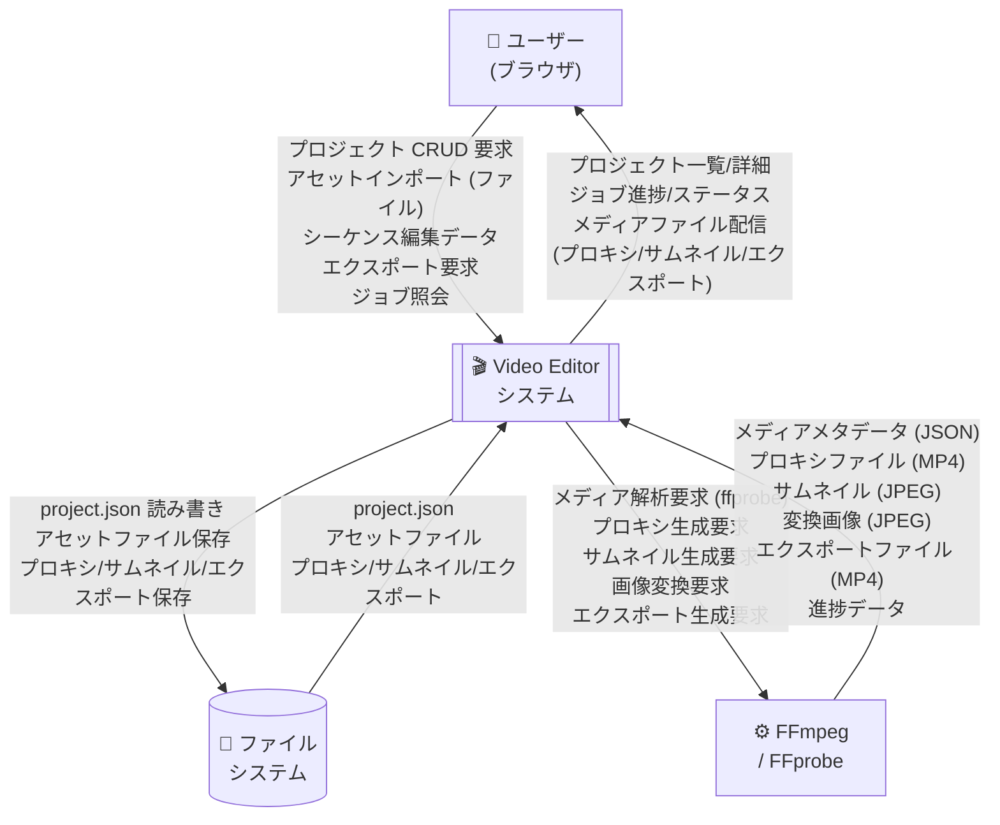
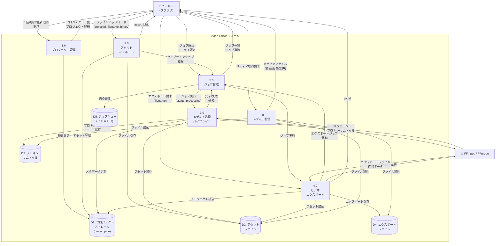
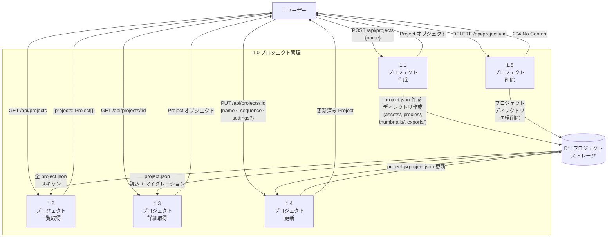
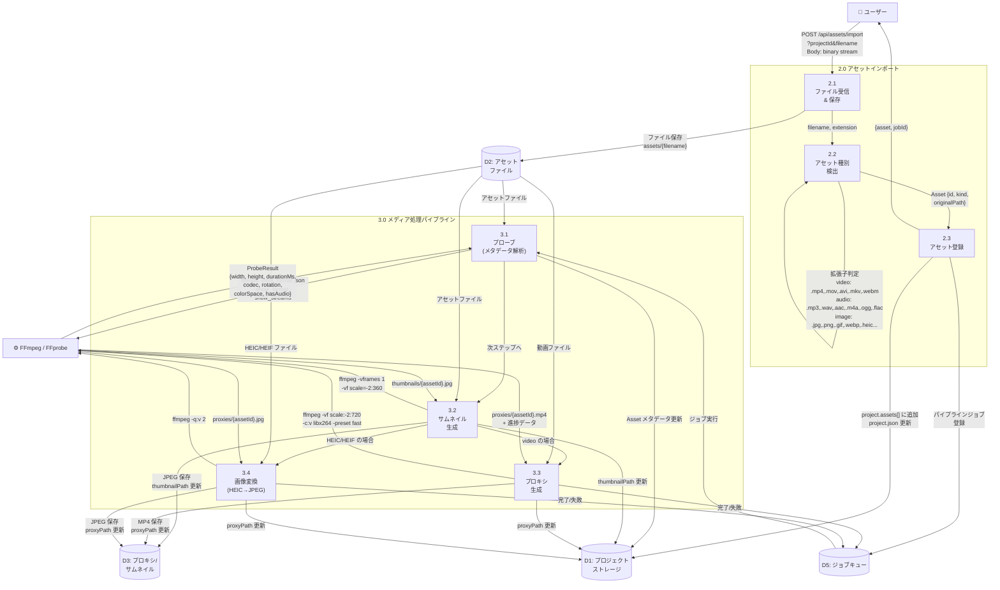
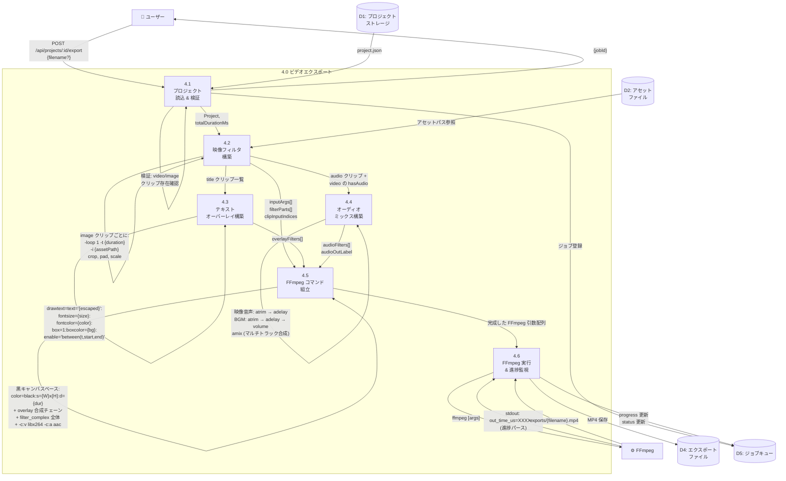
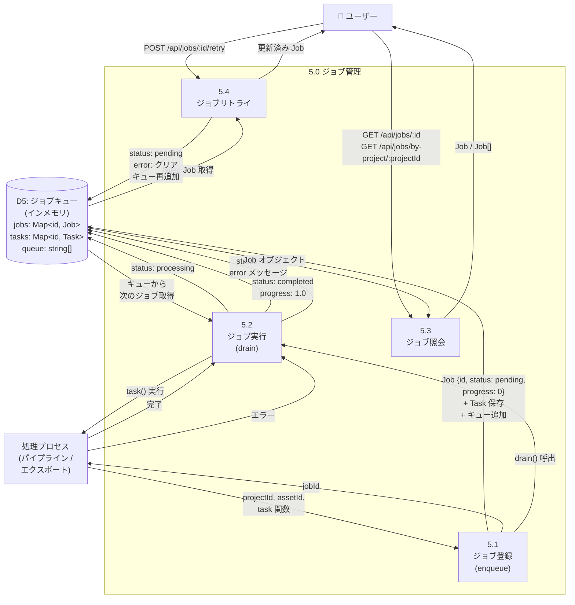
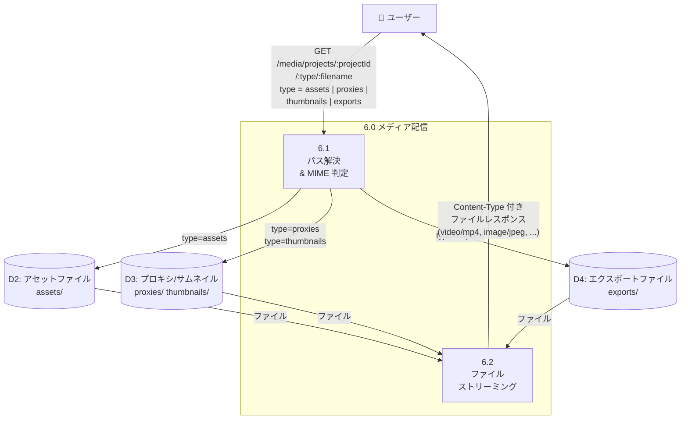

# データフロー図 (DFD)

> ブラウザベースの動画エディタ - Video Editor
> 作成日: 2026-03-14

---

## コンテキストダイアグラム (Level 0)

システム全体と外部エンティティ間のデータフローを示す。

---

## L1 DFD (Level 1)

システム内部の主要プロセスとデータストア間のフローを示す。

---

## L2 DFD - プロジェクト管理 (プロセス 1.0)

---

## L2 DFD - アセットインポート & パイプライン (プロセス 2.0 + 3.0)

---

## L2 DFD - ビデオエクスポート (プロセス 4.0)

---

## L2 DFD - ジョブ管理 (プロセス 5.0)

---

## L2 DFD - メディア配信 (プロセス 6.0)

---

## データストア一覧

| ID | 名称 | 種別 | 物理パス | 内容 |
|----|------|------|---------|------|
| D1 | プロジェクトストレージ | ファイル | `workspace/projects/{projectId}/project.json` | プロジェクト設定、アセットメタデータ、シーケンス（トラック/クリップ）、設定 |
| D2 | アセットファイル | ファイル | `workspace/projects/{projectId}/assets/` | オリジナルのメディアファイル（動画/画像/音声） |
| D3 | プロキシ/サムネイル | ファイル | `workspace/projects/{projectId}/proxies/` `workspace/projects/{projectId}/thumbnails/` | プレビュー用プロキシ (MP4/JPEG)、サムネイル (JPEG) |
| D4 | エクスポートファイル | ファイル | `workspace/projects/{projectId}/exports/` | エクスポート済み動画ファイル (MP4) |
| D5 | ジョブキュー | インメモリ | - | `Map<jobId, Job>`, `Map<jobId, Task>`, `queue: string[]` |

## 外部エンティティ一覧

| 名称 | 説明 | やり取りするデータ |
|------|------|-------------------|
| ユーザー (ブラウザ) | React SPA を操作する利用者 | HTTP リクエスト/レスポンス (JSON + バイナリ) |
| FFmpeg | メディア変換・エクスポート用外部プロセス | コマンドライン引数 → ファイル出力 + 進捗データ |
| FFprobe | メディア解析用外部プロセス | コマンドライン引数 → JSON メタデータ |
